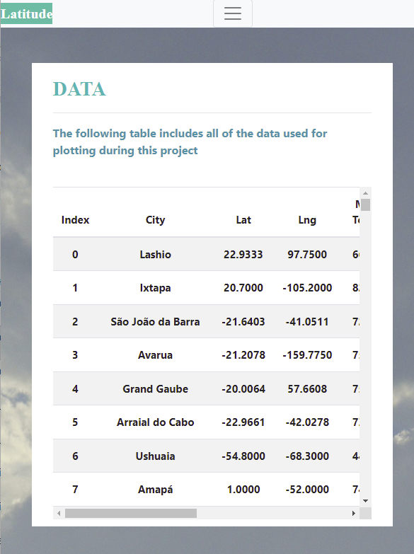

# Web Visualization Dashboard

##### Created by: Estela Perez

##

## Background

HTML and CSS was used to create a website that showcases a dashboard featuring a previous analysis conducted. The analysis consisted of observations that were plotted showing the relationship latitude has on different weather factors suchs as: temperature, humidity, cloudiness, and wind speed.

Bootstrap and @media was used in order to make the website functional and responsive

## The following screenshots can be viewed in my Weather Data Analysis website by clicking on the below link: 
* [WeatherDataAnalysis](https://)

## Landing Page
### Large screen:

## Landing Page
### Small screen:

## Comparisons Page
### Large screen:

## Comparisons Page
### Small screen:

## Data Page
### Large screen:

## Data Page
### Small screen:

## Visualzation Pages
#### There are four of these pages - this is an example of one visualizaion on two different screen sizes:
### Large screen:

## Visualzation Pages
### Small screen:

## Navigation Menu
### Large screen:

## Navigation Menu
### Small screen:

  
